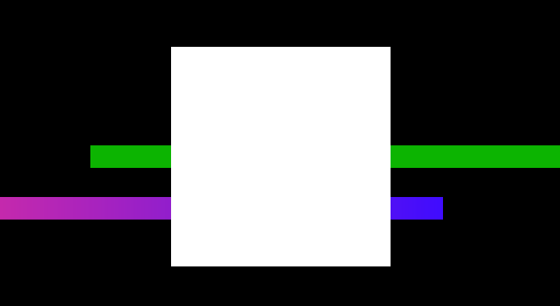
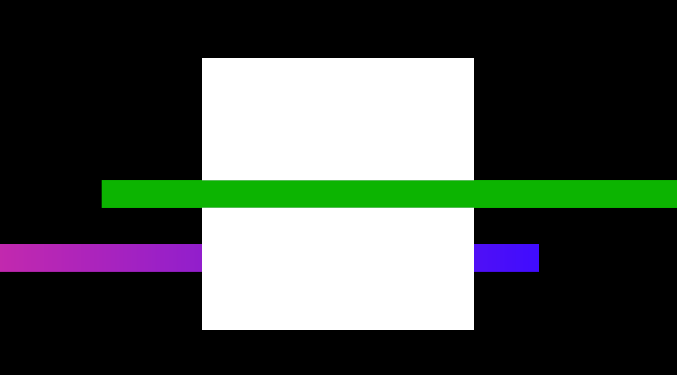
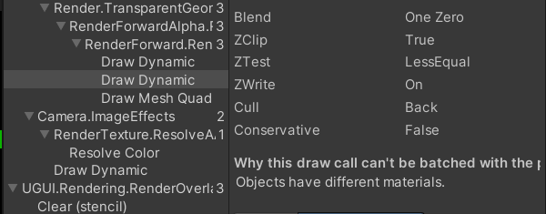
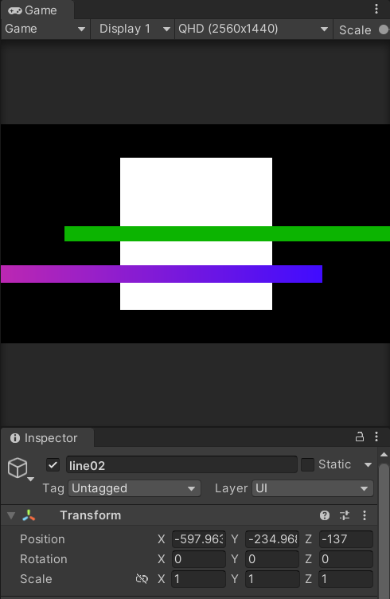
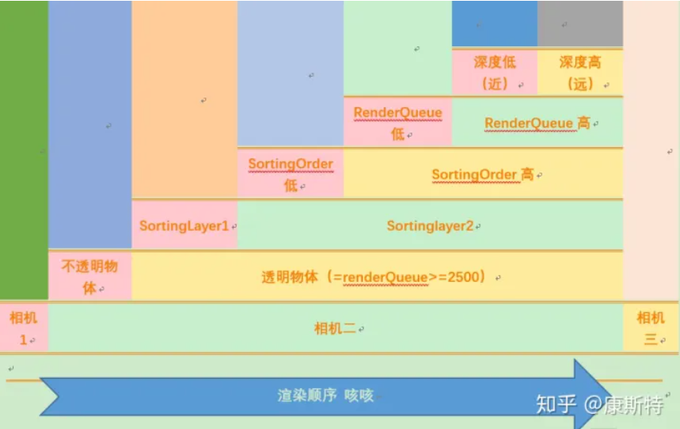

# unity渲染顺序 
这几天在项目中遇到了一个问题，关于渲染顺序的，花了点时间补充了一下unity中的渲染顺序知识

## 问题描述
同一个相机，相同渲染队列，相同深度下，奇怪的遮挡问题

## 第一种情况
+ 一个四面体，Render Queue = 3000，depth = 0
+ 第一条线段，Render Queue = 3000，depth = 0
+ 第二条线段，Render Queue = 3000，depth = 0

*渲染队列3000为半透明队列，队列2500为不透明和透明渲染分割线，不透明物体由近到远渲染，透明队列由远到近渲染*

渲染效果如下：

*白色为四面体，绿色为第一条线段，红色为第二条*

## 第二种情况
+ 一个四面体，Render Queue = 3000，depth = 0
+ 第一条线段，Render Queue = 3000，depth = -1
+ 第二条线段，Render Queue = 3000，depth = -1

渲染结果

这不是我预期的结果，相同渲染队列下的，都为不透明物体，越靠近相机应该越晚渲染吧

**frame debugger**
两条线段使用的是不同的shader，第一条是`Unlit/Color`，第二条是`UI/Default`
debugger中看到`Color`开启了深度写入，而第二条没有：

这导致了，在四面体渲染的时候，会对第一条线条进行深度测试，第二条不会

## 第三种情况
还有一个更好玩的现象：
把第二条线段的深度调整到 `-137`的时候，发现第二条线段又显示了

然后发现绘制顺序发生了改变，第二条线段在最后绘制了

这也是我为什么疑惑的原因了

**最后检查发现：**
 `-137`只是相对父物体的深度，而由于父物体采用了 ` Screen space Camera`的模式，导致scale会自动缩放，真实深度计算后应该比四面体的深度值要小，而且由于缩放尺寸太小，导致了浮点精度丢失问题？？

## 摘录一张渲染顺序图

# 参考资料
[Unity中影响渲染顺序的因素总结](https://zhuanlan.zhihu.com/p/55762351)