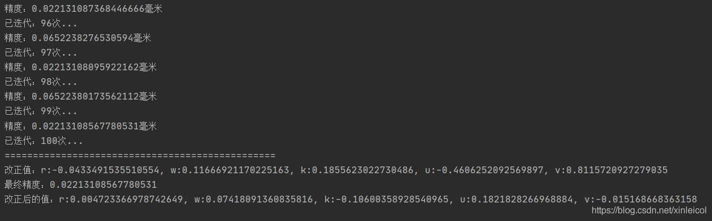
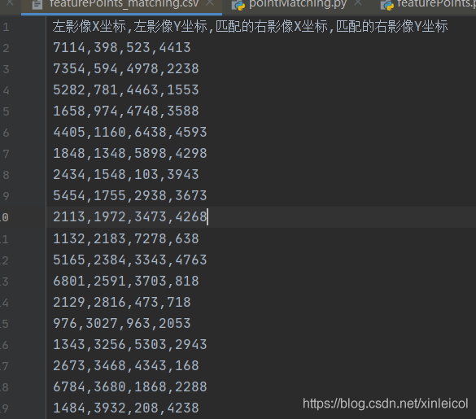

# 摄影测量手动提取立体像对同名点像素，相对定向解算，特征点提取，影像匹配同名点的python实现
## 0 写在前面

1. 摄影测量课程布置的课程大作业，主要要求是：
 独立完成一种相对定向的算法程序设计与开发。功能包括：
（1）打开立体像对，手工屏幕量测像点坐标，转换成像平面坐标（o-xy），取得5个以上同名像点坐标并保存；
（2）进行相对定向计算；
（3）统计观测值的单位权中误差，并实施一种剔除粗差的处理。
（4）采用任意一种匹配算法，通过影像匹配取得同名像点，保存6-10个质量可靠、位置合理的同名像点坐标。重复上面的（2）（3）步骤； 
（5）比较手工量测和计算机自动匹配同名像点，两者对相对定向结果有无差别。

2. 使用的python库
numpy 操作数组和矩阵
cv2 操作图像
pandas 读写文件
3. **文中具体公式原理参照：摄影测量学第二版武汉大学出版社、误差理论与测量平差基础第三版武汉大学出版社。同时，代码也写了注释**
4. **所有的文件代码都会上传，下载地址在文章最后**

## 1 进行立体相对的手工屏幕量测
1. 使用OpenCV，定义一个供setMouseCallback使用的回调函数mouse，这个回调函数在捕获到鼠标左键点击事件(cv2.EVENT_LBUTTONDOWN)时，获取点击的像素点坐标，并绘制一个实心的圆且显示出坐标。
具体实现参照：
[python+OpenCV交互图片获取鼠标单击坐标点（解决大图片显示不全问题）](https://zhuanlan.zhihu.com/p/80663449)
2. 获取得到5对以上的同名点坐标，我选取了9对：

```python
 uvs1 = [[275, 1566, 1], [3205, 1979, 2], [5729, 1748, 4], [6075, 3166, 5], [3933, 3189, 6], [566, 3121, 7], [326, 4469, 8], [3499, 4366, 9], [6110, 4535, 10]] #左片采样点像素坐标,其中3号点位为错误点
 uvs2 = [[676, 315, 1], [3513, 521, 2], [6061, 56, 3], [6502, 1429, 4], [4325, 1659, 5], [1093, 1840, 6], [975, 3127, 7], [3979, 2832, 8], [6633, 2836, 9]] #右片采样点像素坐标[y,x,点号]
```
## 2 像素坐标与像平面、像空间、像空间辅助坐标的转换

1. 像素点坐标转像平面坐标
坐标转换参照：
[计算机视觉：相机成像原理：世界坐标系、相机坐标系、图像坐标系、像素坐标系之间的转换](https://blog.csdn.net/chentravelling/article/details/53558096)
```python
xArrs1 = [] #存放得到的左片像点平面坐标[-x,-y,1] 因为左片在下，右片在上
xArrs2 = [] #存放得到的右片像点平面坐标

# 像素点坐标转像平面坐标
def pixelToImgPoint():
    senserSize = [35.9, 24] #传感器尺寸 宽*高（mm）
    pixelSize = [7360,4912] #像素尺寸 宽*高 （像素）
    u0 = pixelSize[0] / 2 #中心点像素横坐标
    v0 = pixelSize[1] / 2 #中心点像素横坐标
    dx = senserSize[0] / pixelSize[0] #x轴1像素实际大小(mm)
    dy= senserSize[1] / pixelSize[1] #y轴1像素实际大小
    f = 35 #焦距（mm）
    uvs1 = [[275, 1566, 1], [3205, 1979, 2], [5729, 1748, 4], [6075, 3166, 5], [3933, 3189, 6], [566, 3121, 7], [326, 4469, 8], [3499, 4366, 9], [6110, 4535, 10]] #左片采样点像素坐标,其中3号点位为错误点
    uvs2 = [[676, 315, 1], [3513, 521, 2], [6061, 56, 3], [6502, 1429, 4], [4325, 1659, 5], [1093, 1840, 6], [975, 3127, 7], [3979, 2832, 8], [6633, 2836, 9]] #右片采样点像素坐标[y,x,点号]

    A = np.array([[1/dx, 0, u0], [0, 1/dy, v0], [0, 0, 1]])
    for arr1 in uvs1:
        b = np.transpose(np.array([[arr1[0], arr1[1], 1]]))
        x = np.linalg.solve(A, b)
        xArrs1.append(x)
    for arr2 in uvs2:
        b = np.transpose(np.array([[arr2[0], arr2[1], 1]]))
        x = np.linalg.solve(A, b)
        xArrs2.append(x)

```
2. 像平面转像空间辅助坐标
```python
spaceArr1 = [] # 左像空间辅助坐标集合
spaceArr2 = [] # 右像空间辅助坐标集合
# 计算像空间辅助坐标
def computerPixelAssist(r, w, k):
    f = 35.0  # 焦距（mm）
    global spaceArr1,spaceArr2
    spaceArr1, spaceArr2 = [], [] # 清空数组

    if len(xArrs1) ==0 | len(xArrs2) == 0:
        return

    # 左相片做换为像空坐标
    for arr1 in xArrs1:
        # 交换x y轴 再取负
        t = np.copy(arr1[0])
        arr1[0] = -arr1[1]
        arr1[1] = -t

        arr1[2] = -f
        spaceArr1.append(arr1)

    #计算右片旋转矩阵
    # r, w, k = 0, 0, 0
    a1 = np.cos(r)* np.cos(k) - np.sin(r) * np.sin(w) * np.sin(k)
    a2 = -np.cos(r)* np.sin(k) - np.sin(r) * np.sin(w) * np.cos(k)
    a3 = -np.sin(r)* np.cos(w)
    b1 = np.cos(w)* np.sin(k)
    b2 = np.cos(w)* np.cos(k)
    b3 = -np.sin(w)
    c1 = np.sin(r) * np.cos(k) + np.cos(r) * np.sin(w) * np.sin(k)
    c2 = -np.sin(r) * np.sin(k) + np.cos(r) * np.sin(w) * np.cos(k)
    c3 = np.cos(r) * np.cos(w)
    R = np.array([[a1,b1,c1], [a2,b2,c2], [a3,b3,c3]]) #旋转矩阵


    # 计算右片像空间辅助坐标
    for arr2 in xArrs2:
        # 交换x y轴 再取负
        t = np.copy(arr2[0])
        arr2[0] = -arr2[1]
        arr2[1] = -t

        arr2[2] = -f
        b = arr2
        x = np.linalg.solve(R, b)

        spaceArr2.append(x)

```
## 3 粗差检测、计算各个相对定向参数、相对定向解算、迭代计算、精度评定
### 采用连续法相对定向
相对定向、共面方程原理可参照：
[摄测与CV 3: 共面方程，相对定向，绝对定向](https://zhuanlan.zhihu.com/p/101550804)
1. 粗差处理 **数据探测法假设检验粗差**，进行了粗差检验，并没有处理只是输出第几对像点存在粗差，粗差改正可后续添加
注：**数据探测法假设检验**参照**误差理论与测量平差基础**
```python
def findCrossError():
    global X
    if (len(A) == 0) | (len(V) == 0):
        return
    q = 1 # 单位权中误差
    Q = np.eye(9,9) # 9*9的协因数阵
    Qvv = Q - (A * (A.T * A).I * A.T)
    t = 0.05 # 正态分布的阿尔法值
    ut = 1.96 # 正态分布表里的u0.025的限值
    i = 0
    for arr in V:
        u = arr / (q * np.sqrt(Qvv[i,i]))
        if np.abs(u) > ut:
            print("第{}个点存在粗差,粗差为：{}".format(i,arr))
            # 粗差处理
            # X = np.zeros(shape=(5,1))# 舍去改正值
            # print("已改正...")
        else:
            if i == len(V)-1: # 循环结束
                print("未发现粗差...")
        i += 1
```
2. 各相对定向参数结算
解算参数和过程参照**摄影测量学**

```python
X = 0 # A矩阵 L由观测值计算得到的q值 V五个参数的改正值 X真值
V = 0 # 存放改正值
A = 0 # 系数矩阵
def computerNewValue():
    global X, V, A
    L = 0
    i = 0
    while i < len(QArr):
        x2, y2, z2, n1 = spaceArr2[i][0], spaceArr2[i][1], spaceArr2[i][2], N1Arr[i]
        a1 = - (x2 * y2 / z2) * n1
        a2 = - (z2 + y2 * y2 / z2) * n1
        a3 = x2 * n1
        a4 = Bx
        a5 = - (y2 / z2) * Bx

        a = np.array([[a1[0], a2[0], a3[0], a4[0], a5[0]]])
        if i == 0:
            A = a
        else:
            A = np.row_stack((A, a))
        i += 1

    # print(len(A))
    A = np.mat(A)  # 转换成矩阵
    L = np.transpose(np.array([QArr]))
    L = np.mat(L)

    X = (A.T.dot(A)).I.dot(A.T).dot(L)  # A.T求转置 A.I求逆
    V = (A.dot(X) - L)

```
3. 入口函数、迭代计算和精度评定
由于得到的未知数改正值有时无法收敛到限值，未找到原因，故没有以改正值为迭代的收敛条件，而是以迭代次数为收敛条件

```python
if __name__ == '__main__':
    r, w, k = 0, 0, 0 # 起始值
    u, v = 0, 0
    # V = 0 #存放差值
    rDiffi, wDiffi, kDiffi, uDiffi, vDiffi = 0,0,0,0,0  #各差值
    pixelToImgPoint()  # 像素转像平面坐标

    def computer():
        global r,w,k,u,v,V
        global rDiffi,wDiffi,kDiffi,uDiffi,vDiffi
        computerPixelAssist(r, w, k) # 转像空间辅助坐标
        computerParameter(u, v) # 计算各参数
        computerNewValue() #计算新值
        # 计算差值
        # V = X - np.mat([[r,w,k,u,v]]).T
        # print(X)
        rDiffi = X[0, 0]   # 各个差值
        wDiffi = X[1, 0]
        kDiffi = X[2, 0]
        uDiffi = X[3, 0]
        vDiffi = X[4, 0]
    computer()
    findCrossError()

    # 迭代计算，判断是否满足要求
    limit = 0.08 # 限值
    flag = True # 是否继续迭代的指示
    num = 1 # 迭代次数

    # r, w, k, u, v = V[0, 0], V[1, 0], V[2, 0], V[3, 0], V[4, 0]
    # computer()
    while num < 100: #迭代多少次停止
        # if (np.abs(rDiffi) > limit) | (np.abs(wDiffi) > limit) | (np.abs(kDiffi) > limit) | (np.abs(uDiffi) > limit)| (np.abs(vDiffi) > limit): # 超出限值
        print("已迭代：%d次..."%num)
        r,w,k,u,v = rDiffi+r,wDiffi+w,kDiffi+k,uDiffi+u,vDiffi+ v # 参数改正
        precision = np.sqrt((V.T.dot(V))/4)[0,0]
        print("精度：{}毫米".format(precision))
        computer()
        num += 1
    print("已迭代：%d次..." % num)
        # else:
        #     flag = False
        #     break

    print("================================================")
    print("改正值：r:{}, w:{}, k:{}, u:{}, v:{}".format(rDiffi, wDiffi, kDiffi, uDiffi, vDiffi))
    print("最终精度：{}".format(precision))
    print("改正后的值：r:{}, w:{}, k:{}, u:{}, v:{}".format(r,w,k,u,v))
```
运行输出结果如下：
迭代次数、每次迭代后的精度、结果的改正值、结果的精度、相对定向的5参数
**到此相对定向解算完成**

## 4 特征点提取
采用**Moravex算子**进行特征点提取，提取过程如下：
提取左影像的特征点、保存左影像特征点像素坐标、提取部分特征点进项右影像匹配、保存左右影像同名特征点
1.  兴趣值计算
兴趣值计算比较耗时，需要计算接近7360*4912个的像素的兴趣值

```python
# 计算感兴趣值 mat:灰度矩阵 fullSize窗口大小 x中心像元行号 y列号
def getInterestValue(mat, fullSize, x, y):
    halfSize = fullSize // 2
    i = 0
    v1, v2,v3,v4 = 0,0,0,0
    while i < halfSize * 2 :
        v1 += np.power((int(mat[x-halfSize+i,y]) - int(mat[x-halfSize+i+1,y])),2)
        v2 += np.power((int(mat[x-halfSize+i,y-halfSize+i]) - int(mat[x-halfSize+i+1,y-halfSize+i+1])),2)
        v3 += np.power((int(mat[x,y-halfSize+i]) - int(mat[x,y-halfSize+i+1])),2)
        v4 += np.power((int(mat[x-halfSize+i,y-halfSize-i]) - int(mat[x-halfSize+i+1,y-halfSize-i-1])),2)
        i += 1
    v = [v1, v2, v3, v4]
    interest = np.min(v)
    return interest
```

```python
inputimagepath = "./image/left.JPG"
def gray_cvt(inputimagepath): # 入口函数
    img = cv2.imread(inputimagepath)
    gray = cv2.cvtColor(img,cv2.COLOR_RGB2GRAY)# 灰度化 gray_cvt_image为灰度矩阵宽*高
    # cv2.namedWindow('gray')  # 这行没啥用 控制显示图片窗口的名字
    h, w = gray.shape
    # Moravex算子
    grayMat = np.mat(gray)
    interests = np.zeros((h,w)) #兴趣值数组
    fullSize = 9 #窗口大小
    inhibitionsize = 17 #抑制局部最大的窗口大小
    halfSize = fullSize // 2
    halfInhiSize = inhibitionsize // 2
    i, j  = halfSize, halfSize
    sum = 0
    while i < h-halfSize: # 行列数搞错了，计算结果出错 高度为行数
        print("兴趣值计算到{}行".format(i+1))
        j = halfSize # 找半天这个bug 还是太菜了
        while j < w-halfSize:
            interest = getInterestValue(grayMat,fullSize,i,j)
            interests[i][j] = interest #bug 若直接拷贝原数组会部分赋值失败，可能是像素超过255便不赋值
            sum += interest
            j +=1
        i+=1
    print("所有兴趣值计算完毕...")

```

2. 确定阈值、阈值过滤
滤值是由所有兴趣值的均值确定的
注：以下代码在在主函数内

```python
	i, j = halfSize, halfSize
	  	mean = sum / ((w-fullSize )* ( h-fullSize)) #阈值
	    print("阈值{}",format(mean))
	    while i < h-halfSize:
	        print("阈值过滤到{}行".format(i+1))
	        j = halfSize
	        while j < w-halfSize:
	            value = interests[i][j]
	            if value < mean:
	                interests[i][j] = 0
	            j +=1
	        i+=1
	    print("阈值过滤完毕...")
```
3. 抑制局部最大

```python
 # 抑制局部最大
    i, j = halfSize, halfSize
    while i < h-halfInhiSize:
        print("抑制局部最大到{}行".format(i+1))
        j = halfInhiSize
        while j < w-halfInhiSize:
            max = interests[i][j]
            m, n  = 0,  0
            while m < inhibitionsize:
                n = 0
                while n < inhibitionsize:
                    value = interests[i - halfInhiSize + m][j - halfInhiSize + n]
                    if  value < max:
                        interests[i - halfInhiSize + m][j - halfInhiSize + n] = 0
                    n += 1
                m += 1
            j +=1
        i+=1
    print("抑制局部非最大完毕...")
```
4. 最后保存结果，结果为特征点的像素坐标和兴趣值

```python
 # 保存结果
    i, j = halfSize, halfSize
    xs, ys, grayValue = [],[],[]
    while i < h - halfSize:
        j = halfSize
        while j < w - halfSize:
            value = interests[i][j]
            if value > 0:
                xs.append(j)
                ys.append(x)
                grayValue.append(value)
            j += 1
        i += 1
    # 字典中的key值即为csv中列名
    dataframe = pd.DataFrame({'X坐标': xs, 'Y坐标': ys ,'兴趣值': grayValue})
    # 将DataFrame存储为csv,index表示是否显示行名，default=True
    dataframe.to_csv("featurePoints.csv", index=False, sep=',')
    print("所有特征点写入完毕...")
    cv2.waitKey()#等待操作
    cv2.destroyAllWindows()#关闭显示图像的窗口
```
5. 运行结果，featurePoints.csv文件：
注：运行时没有写入兴趣值


## 5 影像匹配
**相关系数**匹配特征点
思路是：读取左影像部分特征点，获得特征点特定大小（这里选取5*5像素）的窗口（**目标窗口**），获得右影像灰度矩阵（**搜素窗口**），右影像矩阵划分成目标窗口大小的矩阵，选定目标窗口逐个对搜素窗口划分后的小窗口进行系数计算，求出最大的系数，该系数对应的小窗口的中心像素即为匹配得到的右影像特征点坐标，最后写入文件
1.  读取影像函数

```python
def readImage(imageName):
    img = cv2.imread(imageName)
    gray = cv2.cvtColor(img, cv2.COLOR_RGB2GRAY)  # 灰度化 gray_cvt_image为灰度矩阵宽*高
    # h, w = gray.shape
    cv2.waitKey()  # 等待操作
    cv2.destroyAllWindows()  # 关闭显示图像的窗口
    return gray
```
2. 读写文件函数

```python
def readFile():
    xys =  []
    df = pd.read_csv(CSV_FILE_PATH)

    for i in range(10000,100000,5000): #间隔取点
        x = df["X坐标"][i]
        y = df["Y坐标"][i]
        xys.append([x,y])
    return xys

def writeFile(xs1,ys1,xs2,ys2):
    dataframe = pd.DataFrame({'左影像X坐标': xs1, '左影像Y坐标': ys1,'匹配的右影像X坐标': xs2, '匹配的右影像Y坐标': ys2})
    dataframe.to_csv("featurePoints_matching.csv", index=False, sep=',')
    print("所有匹配特征点写入完毕...")
```
3. 划分数组

```python
# 划分数组
def divideArr(arr, rows, cloumns):
    h, w = arr.shape
    rowsNum, colNum = [],[]
    i, j = 0,0
    numRow = h // rows #分成几等行
    numClo = w // cloumns #分成几等列
    sigleXYS = [] # 单个搜索区窗口列表
    # 拆分行
    while  i < numRow * rows:
        i += rows
        rowsNum.append(i)
    sigleX = np.split(arr, rowsNum, axis=0)
    finallymat =  sigleX[len(sigleX)- 1]
    gao1 ,kuan1 = finallymat.shape
    if gao1 < rows:
        del sigleX[len(sigleX)- 1]

    t = 0
    while t < len(sigleX):
        # 拆分列
        while j < numClo * cloumns:
            j += cloumns
            colNum.append(j)
        sigleY = np.split(sigleX[t], colNum, axis=1)
        finallymat2 = sigleY[len(sigleY) - 1]
        gao1, kuan1 = finallymat2.shape
        if kuan1 < cloumns:
            del sigleY[len(sigleY) - 1]
        sigleXYS.append(sigleY)
        t += 1
    return sigleXYS

```
4.求相关系数

```python
# 求相关系数
def matching(mat1, mat2):
    m,n  = mat1.shape
    i,j = 0,0
    fz1,fz2,fz3,fm1,fm2 = 0,0,0,0,0

    while i <len(mat1):
        j = 0
        while j < len(mat2):
            a,b = int(mat1[i][j]), int(mat2[i][j])
            fz1 += a * b
            fz2 += a
            fz3 += b
            fm1 += a *a
            fm2 += b *b
            j += 1
        i += 1
    fzp = fz1 - (1/(m* n)) *fz2 *fz3
    fmp1 = fm1 - (1/(m*n))* fz2 *fz2
    fmp2 = fm2 - (1/(m*n)* fz3 *fz3)
    if fmp1* fmp2 == 0: #除数太小 python会看成0 报错
        return 0
    p = fzp / (np.sqrt(fmp1* fmp2)) #相关系数
    return p

```
5. 入口函数

```python
def computerValue(g,g1):
    h, w = g1.shape
    m, n,k,l =5, 5,h, w # m n为目标窗口大小 k l 为搜索影像区域
    r,c = m // 2, n//2
    i,j = 0,0
    sigleXYS = divideArr(g1,m, n) #982*1472
    finalCol = len(sigleXYS)
    finalRow = len(sigleXYS[0])

    xys = readFile()
    if len(xys) == 0:
        print("读取文件失败...")

    pipeiNum = 0
    xbefore, ybefore, xmatch, ymatch = [], [],[],[]  # 匹配的坐标
    for xy in xys:
        x,y  = xy[0],xy[1]
        xbefore.append(x)
        ybefore.append(y)
        E = range(x-r, x+r+1)  # 定义列数
        F = range(y-c, y+c+1)  # 定义行数
        goalMat = g[F]  # 取出需要的行
        goalMat = goalMat[:,E]  # 取出需要的列 X_3为目标矩阵

        ps = [] # 相关系数集合

        i = 0
        while i < finalCol:
            j = 0
            while j < finalRow:
                sigleMat = sigleXYS[i][j]
                p = matching(goalMat,sigleMat)
                ps.append(p)
                j +=1
            i += 1
        pmax = np.max(ps)
        maxIndex = ps.index(pmax)
        goalRow = (maxIndex) // finalCol
        goalCol = (maxIndex) % finalCol
        goalRow = goalRow * m - c
        goalCol = goalCol * n - r
        xmatch.append(goalRow)
        ymatch.append(goalCol)
        pipeiNum += 1
        print("已匹配:{}个像点".format(pipeiNum))

    writeFile(xbefore,ybefore,xmatch,ymatch) #写入文件

```
6. featurePoints_matching.csv内容




## 6 总结
1. 相对定向的收敛条件无法满足，可能的原因是：1.相对定向计算错误，本人检查了几遍，没有发现错误之处。2. 手动选取的同名像点坐标不准确。3.应该不是粗差的问题，假设检验后提示未发现粗差。
2. 特征点的计算出的阈值太小，导致提取的特征点非常多，可按照经验值重新设置。
3. 影像匹配的目标窗口和搜索窗口有时候并没有重叠，导致匹配出的特征点不准确，同时，影像匹配后的同名点存在不准确的情况，有待进一步改正。
4. 计算效率和准确度都没有达到预期效果，不能算是成功完成，只能算是学习的过程。
## 本文的所有代码文件链接已上传至csdn，下载地址：
[点击前往代码下载地址](https://download.csdn.net/download/xinleicol/15533748)